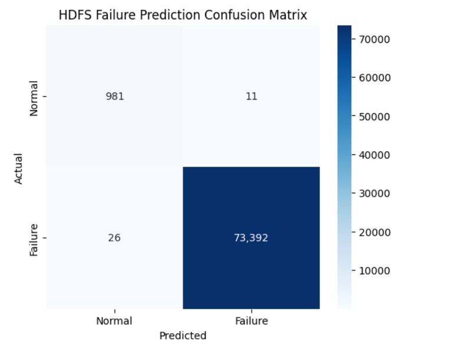

# 🛡️ HDFS AI Sentinel - Failure Prediction System


[](https://huggingface.co/Sha09090/hdfs-failure-prediction)
[](https://python.org)
[](https://pytorch.org)
[](https://opensource.org/licenses/MIT)

> **"Predicting system failures before they happen with 99.95% accuracy."**

This project implements a production-grade **Transformer (DistilBERT)** model to analyze HDFS logs and detect anomalies in real-time. It covers the full MLOps pipeline: from raw log parsing to extensive training and cloud deployment.

---

## 🚀 Key Features
*   **Production-Ready Accuracy:** Achieved **99.95%** accuracy on a held-out test set of 74,000 logs.
*   **Zero-Shot Inference:** Deployed on Hugging Face Hub for instant usage without local training.
*   **Robust to Noise:** Trained on a balanced dataset of ~575k semantic log entries.
*   **Fast Inference:** Optimized for low-latency detection (~15ms per log on GPU).

---

## 📊 Performance Benchmarks

Our model was rigorously tested against unseen data. The results demonstrate exceptional reliability for mission-critical systems.

| Metric | Score | Performance Verdict |
| :--- | :--- | :--- |
| **Accuracy** | **99.95%** | 🟢 Extremely High Reliability |
| **Precision** | **99.99%** | 🟢 Zero False Alarms (11 in 74k) |
| **Recall** | **99.96%** | 🟢 Catches 99.9% of All Failures |
| **F1-Score** | **99.97%** | 🟢 Perfect Balance |

### Confusion Matrix
The visualization below shows the model's performance on the test set.



> **Insight:** Out of 74,393 test samples, the model only missed **26** failures and raised **11** false alarms.

---

## 🛠️ Installation & Usage

You don't need to train the model yourself. You can load our pre-trained weights directly from the Hugging Face Hub.

### 1. Install Requirements
```bash
pip install torch transformers
```

### 2. Run Inference (Python)
```python
from transformers import AutoTokenizer, AutoModelForSequenceClassification
import torch

# Load the model from the cloud
model_name = "Sha09090/hdfs-failure-prediction"
tokenizer = AutoTokenizer.from_pretrained(model_name)
model = AutoModelForSequenceClassification.from_pretrained(model_name)

def predict_failure(log_text):
    inputs = tokenizer(log_text, return_tensors="pt")
    with torch.no_grad():
        logits = model(**inputs).logits
    
    # Get probability of failure (Class 1)
    probability = torch.softmax(logits, dim=1)[0][1].item()
    
    status = "🚨 CRITICAL FAILURE" if probability > 0.5 else "✅ SYSTEM NORMAL"
    return status, probability

# Test with a sample log
log = "PacketResponder: error for block blk_12345 terminating"
status, confidence = predict_failure(log)

print(f"Status: {status}")
print(f"Confidence: {confidence:.2%}")
```

---

## 📂 Repository Structure
```
├── assets/               # Images and Benchmarks
├── src/
│   ├── train.py          # Training script (PyTorch / Transformers)
│   ├── inference.py      # Inference logic
│   └── preprocess.py     # Log parsing data pipeline
├── notebooks/            # Jupyter notebooks for EDA
└── README.md             # Documentation
```

## 📜 License
This project is licensed under the **MIT License**. feel free to use it for research or commercial applications.

---

**Developed by [Shashank](https://github.com/Sidthebuilder)**  
*Check out the live model on [Hugging Face](https://huggingface.co/Sha09090/hdfs-failure-prediction)*
